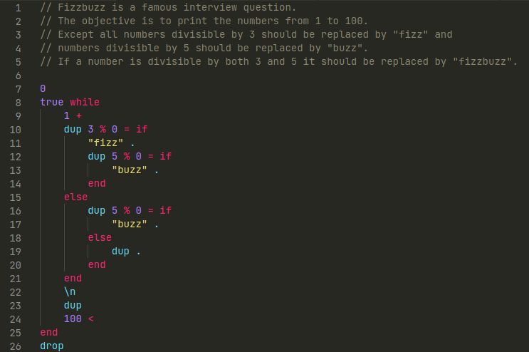

# Aaa extension

This is a work in progress extension for VS Code to support [the Aaa language](https://github.com/lk16/aaa).

### Setup

Run the command below and restart vs code to enable this extension.

```sh
ln -st ~/.vscode/extensions/ $(pwd)/aaa-vscode-extension/
```

### Features
* Highlighting
* Code folding

### Sample



### Dev Links

* [Tool used to generate skelleton for a new language extension](https://code.visualstudio.com/api/get-started/your-first-extension)
* [TextMate Grammar Manual](https://macromates.com/manual/en/language_grammars)
* [Python TextMate Grammar](https://github.com/microsoft/vscode-textmate/blob/main/test-cases/first-mate/fixtures/python.json)
